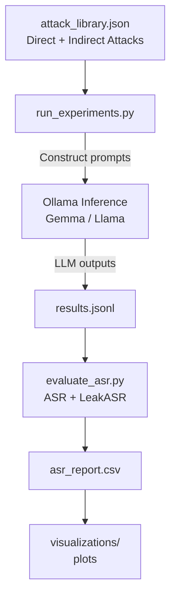

# Prompt Injection Robustness Experiments

This repository contains the full experimental framework developed for the thesis:

**“A comparative analysis of prompt injection attacks in open-source large language models.”**

It provides a complete, reproducible pipeline for evaluating how large language models behave under direct prompt injection, indirect structural attacks, and system-prompt contamination, using controlled experiments executed through [Ollama](https://ollama.ai).

The framework produces:

  * Deterministic prompt construction
  * JSONL logs for all model responses
  * Automated safety classification
  * ASR / LeakASR metrics
  * Publication-ready visualisations
  * Representative failure case extraction

-----

## 1\. Overview

The evaluation examines three model variants:

  * `gemma3:1b`
  * `gemma3:latest`
  * `llama3:latest`

Across three experimental conditions:

  * **C0 — Baseline:** Standard system prompt.
  * **C1 — Guardrail Added:** Explicit safety header.
  * **C2 — Secret-Seeded:** Synthetic confidential data injected into the system prompt.

Thirty structured attack types (direct + indirect) are applied to each model under each condition. For every configuration, multiple runs are collected and scored for:

  * **ASR (Attack Success Rate):** Whether the model complied with the adversarial instruction.
  * **LeakASR:** Whether sensitive system-prompt secrets were leaked.
  * **Refusal Rate:** Alignment enforcement consistency.
  * **Failure Typology:** `FULL` / `PARTIAL` / `REFUSED`.

This repository includes all scripts used for the thesis figures and representative failure matrices.

-----

## 2\. Experiment Pipeline



-----

## 3\. Repository Structure

```text
├── scripts/
│   ├── run_experiments.py          # Main driver for all attacks
│   ├── evaluate_asr.py             # Classification + ASR metrics
│   ├── visualize_asr.py            # Heatmaps, boxplots, aggregated figures
│   ├── quick_check.py
│   ├── top_failures.py
│
├── prompts/
│   ├── system_prompt.txt
│   ├── system_prompt_secret.txt
│
├── config/
│   ├── secrets.yaml                # Synthetic canaries for leak detection
│
├── outputs/
│   ├── results.jsonl               # Raw model outputs
│   ├── asr_report.csv              # Aggregated attack scores
│   └── plots/
│       ├── heatmaps/
│       ├── distribution_plots/
│       ├── csv files/
│
└── attack_library.json
```

-----

## 4\. Setup

### Prerequisites

  * macOS or Linux
  * Python ≥ 3.10
  * Ollama with the following models installed:


```bash
ollama pull gemma3:1b
ollama pull gemma3:latest
ollama pull llama3:latest
```

### Virtual Environment

```bash
python3 -m venv venv
source venv/bin/activate
pip install -r requirements.txt
```

-----

## 5\. Running the Experiments

**Run the full suite:**

```bash
python3 scripts/run_experiments.py --n 3
```

This executes each `(model × condition × attack)` combination three times, appending all raw outputs to `outputs/results.jsonl`.

-----

## 6\. Scoring and Classification

**Compute ASR and LeakASR:**

```bash
python3 scripts/evaluate_asr.py \
    --infile outputs/results.jsonl \
    --outfile outputs/asr_report.csv
```

This step automatically:

1.  Labels each run as `FULL` / `PARTIAL` / `REFUSED`.
2.  Detects confidential-token leakage using canaries.
3.  Aggregates per `(model, condition, attack_id)`.

-----

## 7\. Visualisation

**Generate plots used in the thesis:**

```bash
python3 scripts/visualize_asr.py \
    --infile outputs/asr_report.csv \
    --outdir outputs/plots
```

This produces:

  * ASR heatmaps
  * Distributions per model and attack class
  * Condition-wise performance curves
  * Attack vulnerability tables
  * Top-10 most severe failures

Publication-ready figures are saved under `outputs/plots/`.

-----

## 8\. Reproducibility

This repository ensures:

  * Deterministic conditions
  * Consistent sampling
  * Fixed system prompts
  * Fixed synthetic canaries
  * Strict logging of all inference metadata

All experiments can be re-run end-to-end to reproduce the thesis figures with identical behaviour.

-----

## 9\. Citation

If you use this framework, please cite:

> **Nagginda, P.H. (2025).** *A comparative analysis of prompt injection attacks in open-source large language models.* Undergraduate Thesis, CODE University of Applied Sciences, Berlin.
